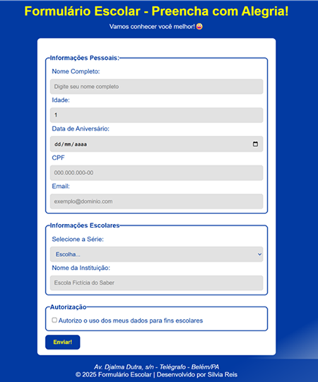

# Formulário Escolar 📝

Este projeto foi desenvolvido como parte do curso de Programador Front-End pela Softex PE.

## Objetivo 🎯

O objetivo deste trabalho é treinar o uso de tags de formulário em HTML, criando uma página de cadastro escolar com validações básicas e layout simples.

## Conteúdo 📚

- Utilização de tags de formulário (input, select, checkbox, etc.)
- Estruturação semântica com fieldset, legend e label
- Validação de campos obrigatórios
- Estilização básica com CSS

## Autor 👩‍💻

Silvia Reis

## Instituição 🏫

Softex PE

## Links 🔗

- [Repositório no GitHub](https://github.com/seu-usuario/seu-repositorio)
- [Página do projeto no GitHub Pages](https://seu-usuario.github.io/seu-repositorio)

## Captura do Projeto 📸

- 

---

Este projeto é apenas para fins de aprendizado e prática das principais tags de formulário em HTML e CSS.
